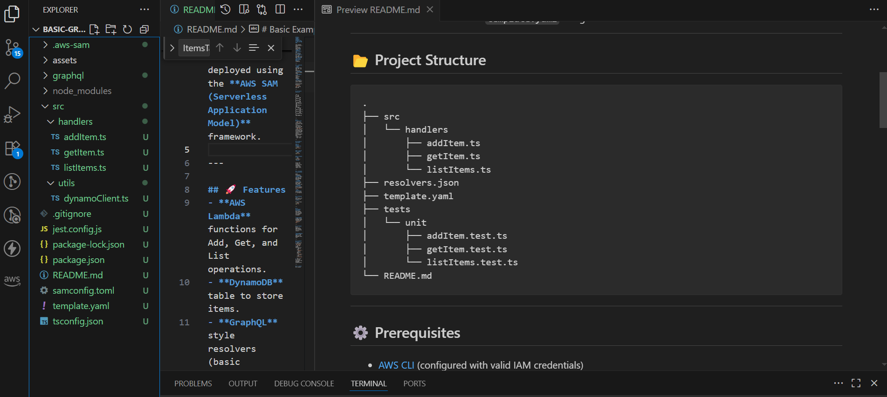
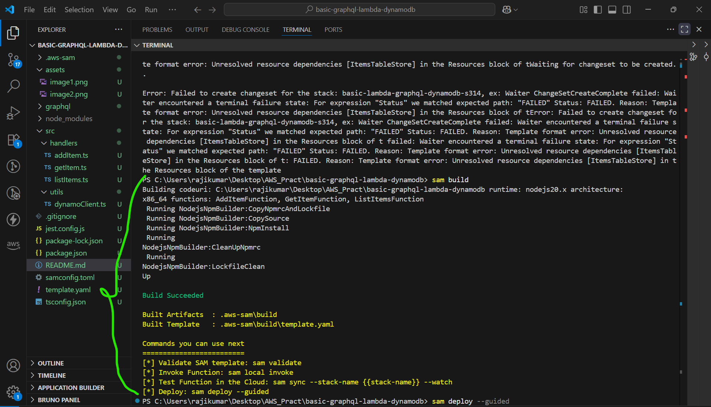
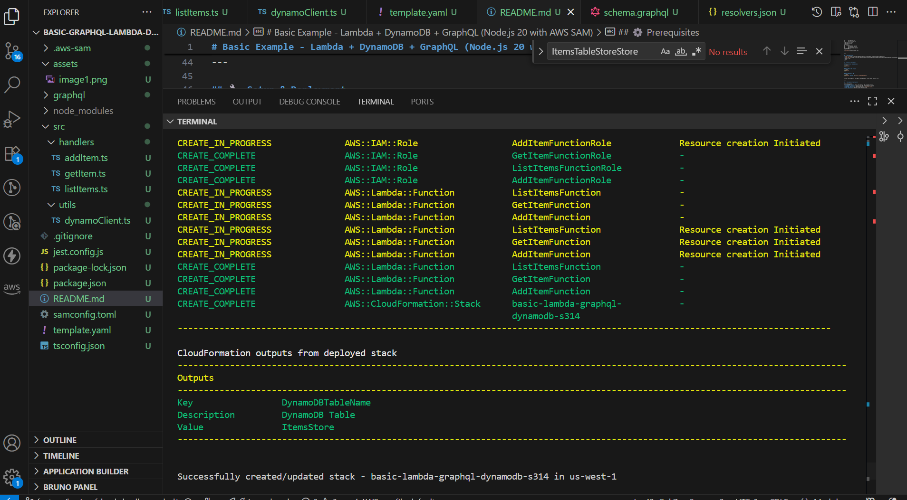
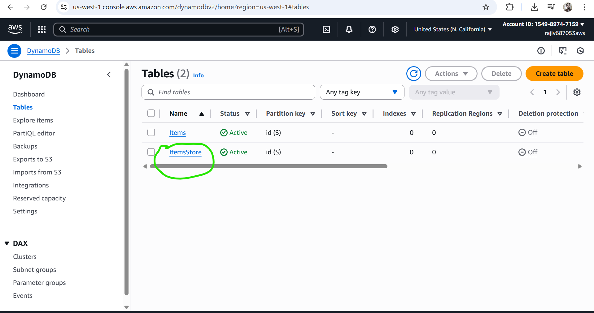
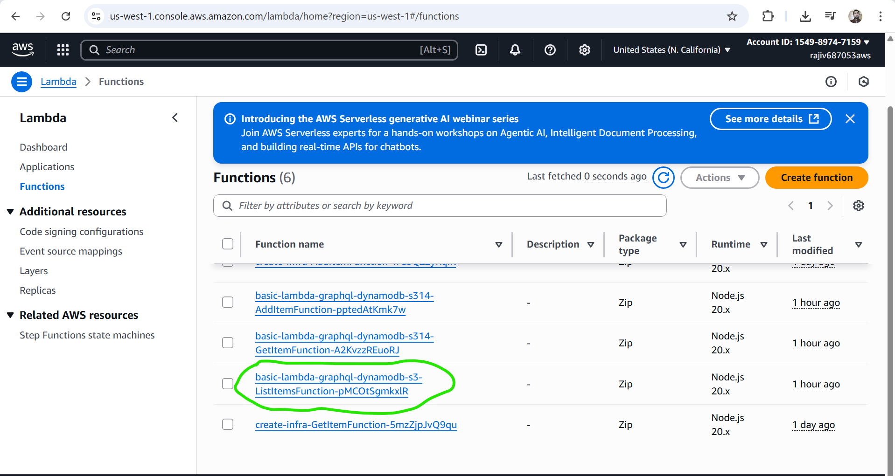

# Basic Example - Lambda + DynamoDB + GraphQL (Node.js 20 with AWS SAM)

This project demonstrates a basic serverless application using **AWS Lambda**, **DynamoDB**, and **GraphQL**.  
It is built with **Node.js 20** and deployed using the **AWS SAM (Serverless Application Model)** framework.

---

## 🚀 Features
- **AWS Lambda** functions for Add, Get, and List operations.
- **DynamoDB** table to store items.
- **GraphQL** style resolvers (basic mapping).
- **S3 (optional)** for storage or static assets.
- Infrastructure defined in `template.yaml` using AWS SAM.

---

## 📂 Project Structure
```
.
├── src
│   └── handlers
│       ├── addItem.ts
│       ├── getItem.ts
│       └── listItems.ts
├── resolvers.json
├── template.yaml
├── tests
│   └── unit
│       ├── addItem.test.ts
│       ├── getItem.test.ts
│       └── listItems.test.ts
└── README.md
```



---

## ⚙️ Prerequisites
- [AWS CLI](https://docs.aws.amazon.com/cli/) (configured with valid IAM credentials)
- [AWS SAM CLI](https://docs.aws.amazon.com/serverless-application-model/latest/developerguide/what-is-sam.html)
- Node.js 20+
- npm 
---

## 🔧 Setup & Deployment

### 1️⃣ Install dependencies
```bash
npm install
```

### 2️⃣ Build the project
```bash
sam build
```


### 3️⃣ Deploy to AWS
```bash
sam deploy --guided (for first time deployment)
```

Follow the prompts to configure the deployment (stack name, region, etc).

---

## 🔍 Validate Infrastructure

After deployment:
- **DynamoDB Table**: Check the table in AWS DynamoDB Console.


- **Lambda Functions**: Invoke using AWS Lambda Console or CLI.

- **GraphQL Resolvers**: Verify mapping in `resolvers.json`.
- **S3 (Optional)**: Verify bucket if configured.

---

## 🧪 Running Tests
Unit tests are written with **Jest**.

Run all tests:
```bash
npm test
```

---

## 📌 Environment Variables
Each Lambda function uses the following environment variable:

- **TABLE_NAME** → Name of the DynamoDB table (injected by `template.yaml`)

---

## 📤 Outputs
After deployment, SAM provides the following outputs:

- **DynamoDBTableName** → The name of the DynamoDB table used.

---

## 📖 Example Workflow
1. Deploy the stack using `sam deploy`.
2. Use the Lambda functions to:
   - Add an item (`addItem`).
   - Get a specific item (`getItem`).
   - List all items (`listItems`).
3. Data will be stored/retrieved from DynamoDB automatically.


